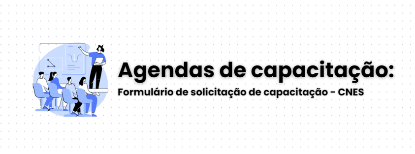



Comunicamos que todas as solicitações para capacitações e treinamentos no âmbito do CNES deverão ser feitas por intermédio das interlocuções regionais ou formalizadas via ofício direcionado à Coordenação Geral de Sistemas de Informação (CGSI/DRAC).

Para possibilitar nosso planejamento e assegurar a organização da agenda técnica e logística necessária à condução dos eventos, pedimos que o ofício contenha as seguintes informações:

- **Justificativa da necessidade do treinamento ou capacitação;**
- **Proposta de pauta a ser abordada no treinamento;**
- **Definição de dias e horários sugeridos;**
- **Perfil do público a ser capacitado, bem como o número de participantes previstos.**

Reforçamos que a solicitação deverá ser encaminhada com antecedência mínima de **20 dias** da data prevista para o evento, permitindo-nos realizar os ajustes necessários e verificar a possibilidade de cumprimento da demanda.

Os formulários de solicitação deverão ser preenchidos a partir do link abaixo e anexados junto ao sistema para envio à área técnica responsável.



Agradecemos a compreensão e nos colocamos à disposição para eventuais esclarecimentos.

