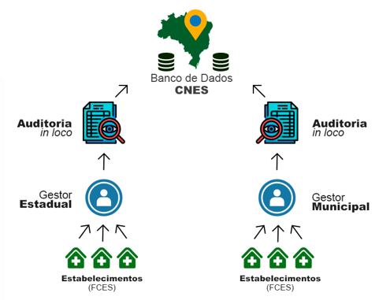
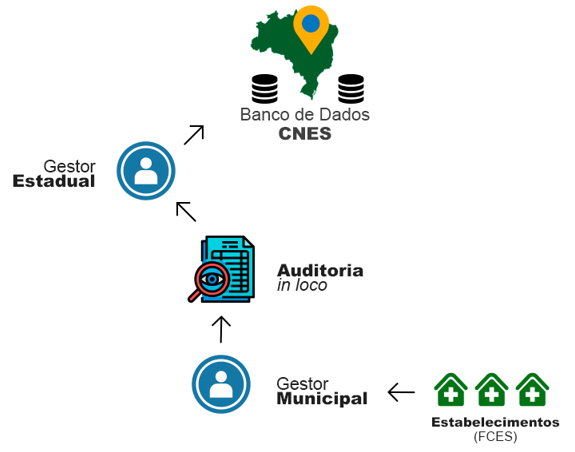



# Fluxo do CNES

O fluxo para o cadastro de um estabelecimento de saúde é de **gestão estadual ou municipal**. O estabelecimento de saúde encaminha as Fichas de Cadastro de Estabelecimento (FCES) ao seu respectivo gestor, que realiza uma **auditoria in loco** para verificar a veracidade das informações. Após a auditoria, o gestor encaminha os dados para o Banco de Dados do CNES, conforme ilustrado na imagem abaixo:

A base nacional do CNES (DBCNES) é um banco de dados especificado em SGBD ORACLE, sob gestão do Ministério da Saúde, que recebe os dados cadastrais enviados pelos gestores estaduais e municipais.

---

## Fluxo de Dupla Gestão

No fluxo de **dupla gestão**, o estabelecimento de saúde encaminha as FCES ao gestor municipal, que realiza uma **auditoria in loco** para verificar a veracidade das informações. Após a verificação, o gestor municipal encaminha as informações ao gestor estadual, que por sua vez as envia ao Banco de Dados do CNES, conforme ilustrado na imagem abaixo:

