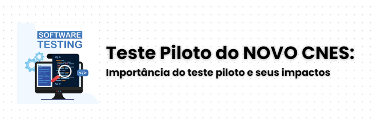



# Teste Piloto do NOVO CNES:

Em articulação tripartite, o Ministério da Saúde em conjunto com o CONASS e CONASEMS, elegeram um rol de municípios pilotos para avaliação do NOVO CNES.

Dentre os principais critérios adotados para avaliação do sistema, forma avaliados:

* Usabilidade
* Segurança e confidencialidade
* Confiabilidade e estabilidade
* Escalabilidade
* Flexibilidade e adaptabilidade
* Eficiência e desempenho
* Integração com outros sistemas
* Suporte e documentação.

# O que é o teste Piloto do NOVO CNES?

Neste contexto, o teste piloto desempenhou um papel crucial na avaliação do NOVO CNES, especialmente por ser um sistema de informação voltado para estabelecimentos de saúde (CNES), sendo acessado simultaneamente por milhares de estabelecimentos de saúde em todo o Brasil. A fase inicial de testes foi fundamental para garantia de que o sistema funcionasse de forma segura, eficiente e confiável antes de seu lançamento oficial para todo o Brasil.

<figcaption>Figura 1 - Gráfico fictício</figcaption>

Em um cenário no qual múltiplos estabelecimentos de saúde, com diferentes realidades regionais e necessidades operacionais, acessam o sistema ao mesmo tempo, o teste piloto permitiu avaliar o desempenho do software em situações de alto volume de acesso. Essa etapa permite identificar possíveis falhas, gargalos e limitações que podem impactar diretamente a experiência do usuário e a qualidade do serviço oferecido.

Além disso, o teste piloto oferece uma oportunidade para validar os requisitos de usabilidade, desempenho e segurança do sistema, garantindo que ele seja capaz de lidar com a carga de acessos e operações simultâneas sem comprometer a integridade dos dados e a proteção das informações. Essa etapa também é essencial para ajustar funcionalidades, interfaces e fluxos de trabalho, aprimorando a navegabilidade e a facilidade de uso para os profissionais de saúde.

Outro aspecto relevante é a **segurança da informação**. Em um sistema que manipula dados sensíveis e protegidos por legislações como a Lei Geral de Proteção de Dados (LGPD), o teste piloto permite avaliar as medidas de proteção e confidencialidade implementadas, assegurando que as informações de saúde estejam devidamente resguardadas contra acessos não autorizados ou vazamentos.

Por fim, o teste piloto envolve a coleta de feedback dos usuários iniciais. Esse retorno é valioso, pois permite que desenvolvedores e gestores do sistema identifiquem pontos de melhoria e façam ajustes antes do lançamento completo, reduzindo significativamente o risco de problemas críticos que possam afetar milhares de estabelecimentos de saúde em todo o país.

Assim, a realização de um teste piloto sólido e abrangente é indispensável para garantir que o sistema de informação atenda aos altos padrões de confiabilidade, segurança e desempenho esperados, promovendo um acesso mais seguro e eficiente para todos os estabelecimentos de saúde do Brasil.

