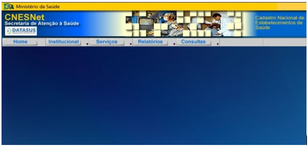



## Sobre o CNESNET:

O acesso ao CNESNet se dá através do endereço http://cnes2.datasus.gov.br.

Este portal está sendo descontinuado, porém ainda existem algumas funcionalidades ativas nele.

O menu de navegação no site é composto por: Institucional, Serviços, Relatórios e Consultas.

Para acessar o detalhamento do conteúdo dos menus contidos no CNESNet,clique aqui.
