

# Registro de Chamados - Webatendimento:



O Webatendimento é a ferramenta oficial do Ministério da Saúde, desenvolvida pelo Departamento de Informática do SUS (DATASUS), que objetiva apoiar estados e municípios na formalização de demandas técnicas referentes aos sistemas de informação do SUS.

Nesta perspectiva, o Cadastro Nacional de Estabelecimentos de Saúde (CNES), adota a partir da presente competência (xx/xx), a ferramenta de webatendimento, para apoiar no registro das solicitações técnicas, em detrimento do antigo canal de comunicação **cnes@saude.gov.br**. A partir de agora, toda e qualquer nova solicitação (dúvidas, sugestões, questionamentos, reporte de erros, etc.), deverão ser feitos exclusivamente pelo novo canal de comunicação.

Abaixo, compartilhamos o passo a passo necessário para o acesso da ferramenta via QR Code ou link, conforme segue abaixo:

### 1. Acesse o Portal no link abaixo:

[https://webatendimento.saude.gov.br/faq/cnes](https://webatendimento.saude.gov.br/faq/cnes)

### Perguntas Frequentes

Ao acessar o link informado, a tela abaixo será carregada. Antes de registrar o chamado, recomendamos fortemente que leia as perguntas frequentes disponíveis na tela inicial e verifique se a sua dúvida já não foi contemplada.

Localize no menu suspenso a dúvida desejada!! Clique no menu e verifique a orientação.

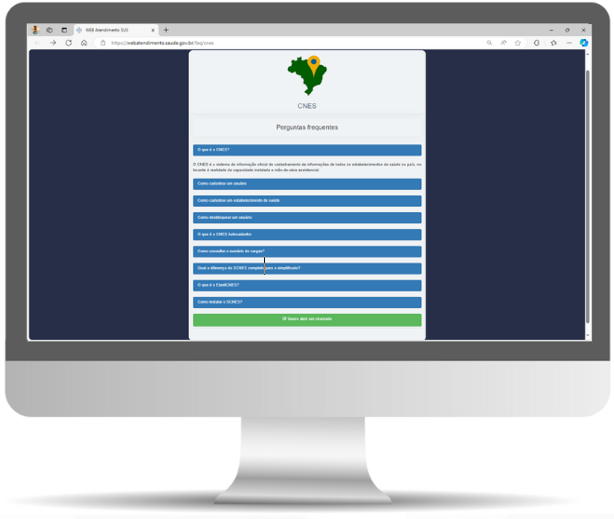

### 2. Registrando o Chamado:

Caso não tenha localizado sua dúvida nas perguntas frequentes, clique no botão “Quero abrir um chamado”:

, para que possamos entrar em contato no decorrer do seu atendimento. É importante destacar que estes campos são de preenchimento obrigatório para o registro de um novo chamado:

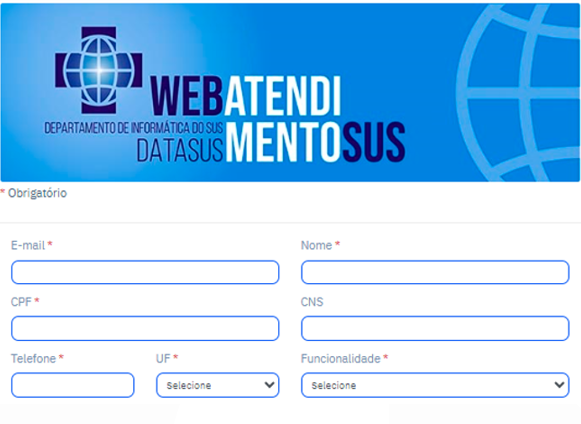

Marque corretamente o campo “funcionalidade” de acordo com o problema desejado. Caso não identifique a opção desejada, marque “outros assuntos”.

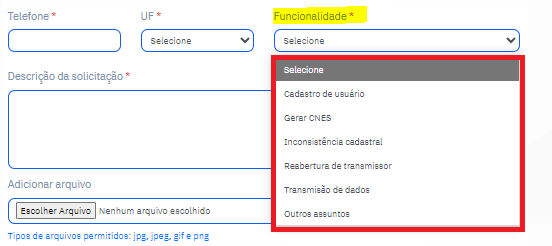

Para maior agilidade na resposta da sua solicitação, é importante que descreva de forma objetiva e clara a sua requisição. Se necessário, anexe prints evidenciando o problema relatado:

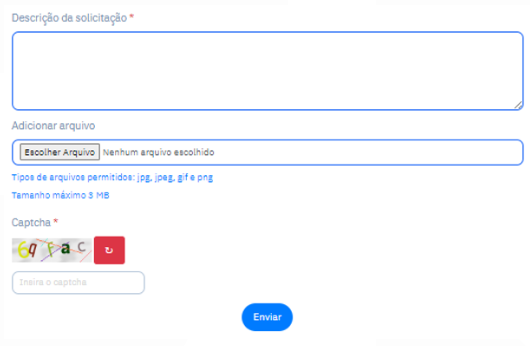

**Observação:** Nos anexos, só serão aceitos arquivos nos formatos .gif, .jpeg, .gif e .png, com tamanho máximo de 3MB. Caso precise enviar um vídeo, compartilhe-o via armazenamento em nuvem e forneça o link com as permissões de acesso.

4. Preencha o captcha e clique em **"Enviar"**.

Após registrar o chamado, um protocolo de atendimento será gerado e exibido na tela. Você também receberá o número do ticket no e-mail informado, com um link para acompanhar sua solicitação.

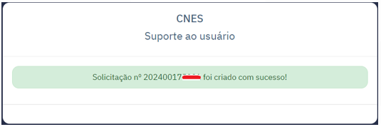

Você também receberá no e-mail informado o número do ticket registrado, com o link para o acompanhamento da sua solicitação. Para acompanhá-la, basta clicar em “clique para acompanhar seu atendimento”.

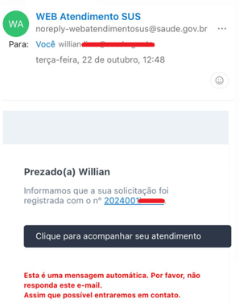

Informe seu CPF e o número da solicitação enviada por e-mail; preencha a captcha e clique em “pesquisar”.

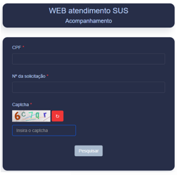

Verifique o progresso da sua solicitação e consulte o status do andamento.

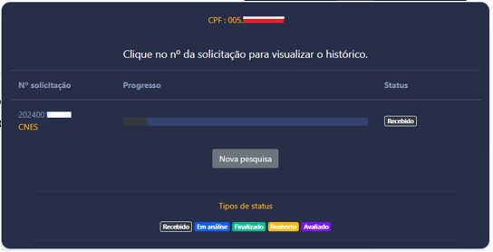

Ao clicar no número do ticket, será carregado a linha cronológica com as interações técnicas que já foram realizadas no seu atendimento.

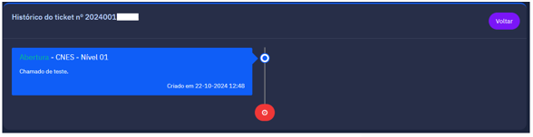

### Conclusão do Atendimento:

Depois que o chamado for finalizado, chegará no e-mail cadastrado a resposta da solicitação:

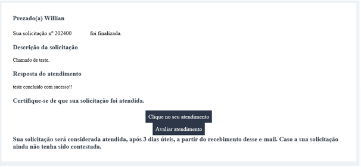

**Atenção:** Após **3 dias úteis**, caso não haja retorno da solicitação, sua demanda técnica será considerada atendida e não haverá possibilidade de reabertura do chamado.

Em “clique no seu atendimento”, será possível informar se a solicitação foi atendida ou não. Informe conforme o caso:

Informe se sua solicitação foi atendida; caso negativo, clique em “não” e informe o motivo da reabertura e clique em “enviar”.

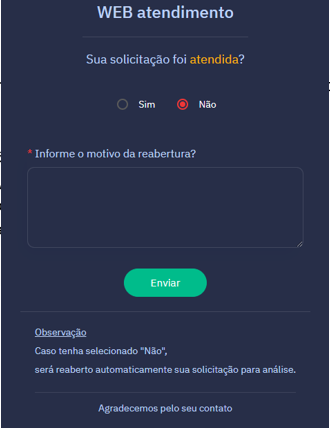

Se a solicitação tiver sido atendida, você será convidado a avaliar a Pesquisa de satisfação. Ressaltamos que a sua resposta é fundamental para o aprimoramento dos nossos serviços:

Clicando em “fechar” o chamado será finalizado automaticamente não havendo possiblidade de reabertura.

Informe a nota da sua avaliação, conforme as numerações abaixo:

Informe sua nota de satisfação, conforme as opções abaixo:

- Muito insatisfeito
- Insatisfeito
- Indiferente
- Satisfeito
- Muito satisfeito

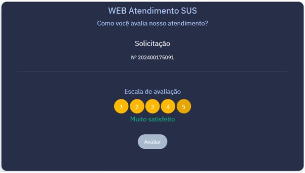
